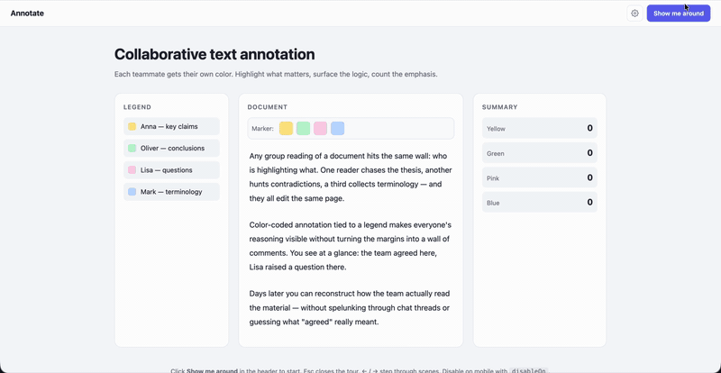

# onboarding-zoom

> Cinematic onboarding tours for live websites.



The camera flies around the page, zooms into the feature you want to highlight, animates a fake cursor, makes the click, shows the result, then pans to the next hotspot. Replaces the dilemma of "describe the new feature in a tooltip vs. record a separate screencast" with a guided, cinematic experience that lives on your real UI.

**[Live demo →](https://kra-so.github.io/onboarding-zoom/demo.html)**

- No dependencies. Single ~30kb file (uncompressed), drop in via `<script>`.
- Works on any HTML page. No framework lock-in.
- 16 locales out of the box, plus runtime locale sync (`<html lang>`, custom DOM event, or imperative API).
- Theming via CSS variables (`dark` / `light` presets or your own).
- Built-in device gating (skip on mobile, narrow screens, touch, custom rules).
- Forward / back navigation with accelerated camera transitions.
- Optional state revert (snapshot innerHTML, restore on tour end).
- Optional `runOnce` mode that auto-starts on first visit and remembers in `localStorage`.

---

## Quick start

```html
<script src="onboarding-zoom.js"></script>
<script src="locales/en.js"></script>
<script>
  const tour = OnboardingZoom.create({
    locale: 'en',
    excludeFromCamera: ['.site-header'],
    scenes: [
      {
        target: '#editor',
        zoom: 1.5,
        title: 'Text annotation',
        caption: 'Highlight any fragment with one click.',
        actions: [
          { type: 'highlight', selector: '#editor p:first-child', holdMs: 600 },
          { type: 'selectText', selector: '#editor p:first-child', start: 0, end: 30 },
          { type: 'click', selector: '.marker[data-color="yellow"]', afterMs: 400 }
        ]
      },
      {
        target: '.legend',
        keepZoom: true,
        title: 'Legend',
        caption: 'Each user has their own color.',
        actions: [
          { type: 'pulse', selector: '.legend-item:first-child', duration: 800 }
        ]
      }
    ]
  });

  document.querySelector('#start-tour').addEventListener('click', () => tour.start());
</script>
```

---

## Installation

Copy `onboarding-zoom.js` into your static assets, plus any locale files you need from `locales/`.

```html
<script src="/assets/onboarding-zoom.js"></script>
<script src="/assets/locales/en.js"></script>
<script src="/assets/locales/de.js"></script>
```

Or pull all 16 locales at once (~1.5kb gzip):

```html
<script src="/assets/onboarding-zoom.js"></script>
<script src="/assets/locales/all.js"></script>
```

Locale files registered after the library script are picked up automatically. If a locale file loads *before* the main library, it queues itself on `window.__OZ_LOCALES_PENDING__` and the library drains the queue on init.

---

## Configuration

```js
const tour = OnboardingZoom.create({
  // Camera root. 'body' wraps body children into a stage div automatically.
  // Pass a selector or Element to scope the camera to a specific region.
  cameraRoot: 'body',

  // Selectors to keep OUT of the camera (header, modals, chat widgets).
  // position: fixed and position: sticky elements are auto-excluded.
  excludeFromCamera: ['.site-header'],

  // Camera transition speed (ms) for cinematic playback.
  transitionMs: 700,

  // User-initiated next/prev/goto uses this multiplier for snappier feel.
  fastFactor: 0.45,

  // Default zoom for scenes that don't specify one explicitly.
  initialZoom: 1.4,

  // Pan-style intro animation between scenes ('direct' | 'zoomOut').
  interscene: 'direct',

  // HUD chrome — on by default.
  showControls: true,
  showCursor: true,
  showDim: true,

  // Keyboard shortcuts.
  closeOnEsc: true,
  keyboardNav: true,        // ArrowLeft / ArrowRight

  // Theme: preset name or custom object of CSS variables.
  theme: 'dark',            // 'dark' | 'light' | { bg, fg, accent, ... }

  // Locale: registered code or full/partial object.
  locale: 'en',

  // Auto-sync locale with the host site.
  watchHtmlLang: false,           // observe <html lang="..."> changes
  localeEventName: null,          // listen for a custom DOM event

  // One-shot auto-start that remembers in localStorage.
  runOnce: false,
  storageKey: 'oz_tour_dismissed',
  autoStart: false,
  autoStartDelay: 0,              // ms to wait between DOMReady and auto-firing start()
  startDelay: 0,                  // ms to wait inside start() before the tour actually begins
                                  //   — applies to manual tour.start() AND auto-start
                                  //   — overridable per call: tour.start({ delay: 1500 })
                                  //   — cancellable via tour.cancelStart() or tour.skip()

  // Restore DOM after the tour ends (undo clicks/typing/highlights).
  revertOnEnd: false,
  snapshotTargets: null,          // optional list of selectors to snapshot

  // Device gating — disable the tour on certain device profiles.
  disableOn: {
    disableBelow: null,           // disable if window.innerWidth < this
    disableAbove: null,           // disable if window.innerWidth > this
    heightBelow: null,
    touch: false,                 // disable on touch-capable devices
    coarsePointer: false,         // disable on @media (pointer: coarse)
    mobile: false,                // disable based on user-agent
    userAgent: null,              // RegExp source string
    custom: null                  // function() => boolean
  },

  // Hooks (also available via tour.on)
  onStart:       null,
  onEnd:         null,
  onSkip:        null,
  onSceneEnter:  null,
  onSceneExit:   null,

  // The actual scenes.
  scenes: [ /* ... */ ]
});
```

---

## Scene shape

```js
{
  // Required: element to focus the camera on.
  target: '#editor p:first-child',

  // Optional: zoom level. Omit + set keepZoom to pan without scale change.
  zoom: 1.8,

  // Just pan to target, keep current camera scale (great for sequential pans).
  keepZoom: false,

  // HUD content.
  title: 'Step 1',
  caption: 'Single line, multiple paragraphs (array), or { html: "<b>rich</b>" }',

  // Optional camera tuning per scene.
  transitionMs: 700,
  easing: 'easeInOutCubic',

  // Auto-advance instead of waiting for user click.
  autoAdvance: false,
  autoAdvanceDelay: 800,

  // Action sequence — runs after the camera arrives.
  actions: [ /* ... */ ]
}
```

---

## Actions

The action runner executes a list per scene. Built-in actions:

| Type           | Purpose                                                    |
| -------------- | ---------------------------------------------------------- |
| `wait`         | Sleep `ms` milliseconds                                    |
| `waitFor`      | Wait until `selector` appears (uses MutationObserver)      |
| `moveCursor`   | Animate the fake cursor to a selector or coords            |
| `click`        | Move cursor + visual ripple + dispatch real click          |
| `type`         | Simulate typing into an input (fires real `input` events)  |
| `selectText`   | Programmatic text selection inside an element              |
| `highlight`    | Spotlight box that follows its target across camera moves  |
| `pulse`        | Pulsing ring overlay on an element                         |
| `comment`      | Tooltip bubble pinned to an element with arrow             |
| `clearComments`| Remove all comment bubbles                                 |
| `pan`          | Pan camera to a different element mid-scene                |
| `setZoom`      | Change zoom on the current scene's target                  |
| `say`          | Update HUD title/caption mid-scene                         |
| `custom`       | Escape hatch — `{ type: 'custom', fn: ctx => {...} }`      |

You can register custom actions globally:

```js
OnboardingZoom.registerAction('flashScreen', async (action, ctx) => {
  document.body.style.background = action.color || 'red';
  await new Promise(r => setTimeout(r, 300));
  document.body.style.background = '';
});
```

### Click without side-effects

If you want the user to be able to step forward and back without re-firing real handlers, set `dispatch: false`. The cursor still animates and the ripple still fires — only the synthetic `click()` call is skipped.

```js
{ type: 'click', selector: '.publish-btn', dispatch: false, afterMs: 300 }
```

---

## API

### `OnboardingZoom.create(options) -> Tour`

Creates a tour. Doesn't start it — call `tour.start()`.

### Tour instance

```js
tour.start();              // Promise<boolean> — false if blocked by device gating / runOnce flag
tour.next();               // advance to next scene (fast camera)
tour.prev();               // back to previous (fast camera)
tour.goto(sceneIndex);     // jump to a specific scene
tour.skip();               // close the tour, fire onSkip, persist runOnce flag
tour.setLocale(codeOrObj); // switch HUD language live
tour.canRun();             // { ok: boolean, reason?: string }
tour.active;               // boolean
tour.idx;                  // current scene index (-1 before start)

tour.on('start',       fn);
tour.on('sceneEnter',  (scene, index) => {});
tour.on('sceneExit',   (scene, index) => {});
tour.on('end',         ({ skipped }) => {});
tour.on('skip',        fn);
```

### Module helpers

```js
OnboardingZoom.canRun(options);        // check device gating without creating a Tour
OnboardingZoom.hasSeen(storageKey);    // boolean — has runOnce been satisfied?
OnboardingZoom.resetSeen(storageKey);  // clear the flag
OnboardingZoom.themes;                 // { dark, light } presets
OnboardingZoom.locales;                // mutable registry of registered locales
OnboardingZoom.registerAction(name, fn);
OnboardingZoom.version;
```

---

## Internationalization

The library ships with English defaults. Other languages live in `locales/*.js` and self-register into `OnboardingZoom.locales` on load.

```html
<script src="onboarding-zoom.js"></script>
<script src="locales/ru.js"></script>
<script src="locales/de.js"></script>
<script src="locales/fr.js"></script>
```

```js
OnboardingZoom.create({ locale: 'ru', /* ... */ });
```

### Bundled locales

`en`, `ru`, `uk`, `es`, `de`, `fr`, `it`, `pt`, `pl`, `cs`, `tr`, `nl`, `zh`, `ja`, `ko`, `ar`. All 16 in one shot via `locales/all.js`.

### Locale shape

```js
{
  next: 'Next',         // primary action button
  prev: 'Back',         // secondary action button
  finish: 'Done',       // primary button on the last scene
  skip: 'Close',        // close icon aria-label
  step: 'Step',         // dot fallback label when a scene has no title
  onboarding: 'Onboarding'  // HUD dialog aria-label
}
```

Partial objects are fine — missing keys fall through to English.

### Sync locale with the host site

Three options, pick whichever fits your i18n setup:

**1. Watch `<html lang>`** — zero coupling, observer-based.

```js
OnboardingZoom.create({ locale: 'en', watchHtmlLang: true, /* ... */ });
// Anywhere in your i18n logic:
document.documentElement.lang = 'fr';
// HUD redraws in French immediately. Also catches first paint.
// Falls back from 'pt-BR' to 'pt' if base language is registered.
```

**2. Custom DOM event** — when your i18n state isn't reflected in `<html lang>`.

```js
OnboardingZoom.create({ localeEventName: 'app:locale', /* ... */ });
// In your store/router:
document.dispatchEvent(new CustomEvent('app:locale', { detail: 'ja' }));
// Or with a partial override object:
document.dispatchEvent(new CustomEvent('app:locale', {
  detail: { next: 'GO!', finish: 'Done!' }
}));
```

**3. Imperative** — most direct.

```js
const tour = OnboardingZoom.create({ /* ... */ });
i18n.on('change', code => tour.setLocale(code));
```

All three update the HUD live: buttons, dots, ARIA labels, and fallback step labels redraw on the spot.

> **Note:** locale only affects HUD chrome. Scene titles and captions are your content. For multi-language scenes, either re-create the tour when the language changes, or run your titles/captions through your own translation function.

### Adding a new locale

```js
// locales/sv.js
(function (global) {
  var locale = {
    next: 'Nästa',
    prev: 'Tillbaka',
    finish: 'Klar',
    skip: 'Stäng',
    step: 'Steg',
    onboarding: 'Genomgång'
  };
  if (global.OnboardingZoom && global.OnboardingZoom.locales) {
    global.OnboardingZoom.locales.sv = locale;
  } else {
    (global.__OZ_LOCALES_PENDING__ = global.__OZ_LOCALES_PENDING__ || []).push(['sv', locale]);
  }
}(typeof window !== 'undefined' ? window : this));
```

---

## Theming

All colors live in CSS variables prefixed `--oz-*`. Pass a preset name or an object of overrides:

```js
OnboardingZoom.create({ theme: 'light', /* ... */ });
OnboardingZoom.create({ theme: 'dark',  /* ... */ });

OnboardingZoom.create({
  theme: {
    bg: 'rgba(28, 18, 48, 0.96)',
    fg: '#fff5e6',
    accent: '#ff6b6b',
    accentStrong: '#e05151',
    accent2: '#ffb85c',
    spotlight: '#ff6b6b',
    pulse: 'rgba(255, 107, 107, 0.7)',
    radius: '18px'
  }
});
```

### Available theme keys

`bg`, `fg`, `fgMuted`, `accent`, `accentStrong`, `accent2`, `spotlight`, `dim`, `spotlightOverlay`, `track`, `trackHover`, `cursorRing`, `pulse`, `cursorFill`, `cursorStroke`, `shadow`, `shadowSoft`, `radius`, `radiusSm`.

Anything you don't override falls back to the dark preset defaults defined in `:root`. The library applies your theme via inline custom properties on `<html>` when the tour starts and removes them on teardown — pre-existing `--oz-*` values are restored exactly.

You can also style around it without options — just write your own CSS rule against `:root` (or any ancestor of the HUD) and the cascade picks it up.

---

## Device gating

Skip the tour on devices where it doesn't make sense:

```js
disableOn: {
  disableBelow: 760,        // narrow screens
  disableAbove: 2400,       // ultra-wide (rare)
  touch: true,              // any touch-capable device
  coarsePointer: true,      // pointer: coarse media query
  mobile: true,             // user-agent string contains Mobi/Android/iPhone/iPad
  userAgent: '/Headless/i', // custom regex
  custom: () => navigator.connection && navigator.connection.saveData
}
```

`tour.start()` returns `false` if a gate matches and logs the reason. Combine with `runOnce: true` to also avoid showing on devices where the tour is gated *and* not retry on later visits.

---

## State revert

If your tour clicks real buttons or fills inputs, you can roll the DOM back to its pre-tour state on close:

```js
OnboardingZoom.create({
  revertOnEnd: true,                            // default: snapshots the camera root
  snapshotTargets: ['#editor', '#stats-panel'], // or restrict to specific zones
  scenes: [/* ... */]
});
```

The library captures `innerHTML` of the targets at tour start and writes it back on teardown.

**Caveats:**

- This is `innerHTML` replacement. It works great for vanilla DOM and simpler SPAs where components own their own DOM. Deeply reactive frameworks (React/Vue at scale) can desync — if your virtual DOM tree thinks a node still exists but you've replaced it under their feet, behavior gets weird. For SPAs, prefer the imperative pattern: use `onStart`/`onEnd` to flip a "demo mode" flag in your state and let your framework handle the swap.
- Network calls fired during the tour aren't undone. If a real `click` posted to your API, that's done.
- Focus, scroll position inside elements, and text selection are not restored (selection is explicitly cleared to avoid pointing into orphaned nodes).

For tours that step backwards and forwards without side-effects, use `dispatch: false` on click actions and visually mimic the result instead.

---

## One-time auto-start

```js
OnboardingZoom.create({
  runOnce: true,
  storageKey: 'esgo_intro_v1',  // version your key — bump it to re-show the tour
  autoStartDelay: 800,
  scenes: [/* ... */]
});
```

Behavior: on `DOMContentLoaded`, library checks `localStorage[storageKey]`. If unset, it auto-starts after `autoStartDelay` ms. On tour end (skip or finish), it sets the flag. Manual `tour.start()` always works — the flag only gates auto-start.

A "show me the tour again" button:

```js
document.querySelector('#replay-tour').addEventListener('click', () => {
  OnboardingZoom.resetSeen('esgo_intro_v1');
  tour.start();
});
```

---

## How the camera works (under the hood)

The camera transforms a "stage" element via `transform: translate(tx, ty) scale(s)` with `transform-origin: 0 0`. When `cameraRoot` is `body`, the library wraps body's static children into a generated `<div class="oz-stage">` (auto-excluding `position: fixed` / `position: sticky` elements so they keep their viewport-relative behavior). When the tour ends, the wrapper is unwrapped and the DOM is back to where it was.

Centering math (with `transform-origin: 0 0`):

```
tx = innerWidth  / 2 − (target.layoutX + target.layoutW / 2) × scale
ty = innerHeight / 2 − (target.layoutY + target.layoutH / 2) × scale
```

Layout coords are recovered from `getBoundingClientRect()` by inverting the current transform.

`Spotlight` and `Comment` overlays are positioned in viewport pixels but *track* their target element via `requestAnimationFrame` so they stay anchored across camera transitions.

---

## Browser support

- Modern Chrome, Firefox, Safari, Edge.
- Uses `MutationObserver`, `requestAnimationFrame`, `AbortController`, `getBoundingClientRect`, CSS `transform`, CSS custom properties.
- No IE11 support.

---

## Files

```
onboarding-zoom.js     ~28kb — main library (no deps)
locales/en.js          ~0.4kb each
locales/ru.js
locales/uk.js
locales/es.js
locales/de.js
locales/fr.js
locales/it.js
locales/pt.js
locales/pl.js
locales/cs.js
locales/tr.js
locales/nl.js
locales/zh.js
locales/ja.js
locales/ko.js
locales/ar.js
locales/all.js         ~3kb — all 16 in one file
demo.html              working example with text-annotation feature
```

---

## License

MIT.
